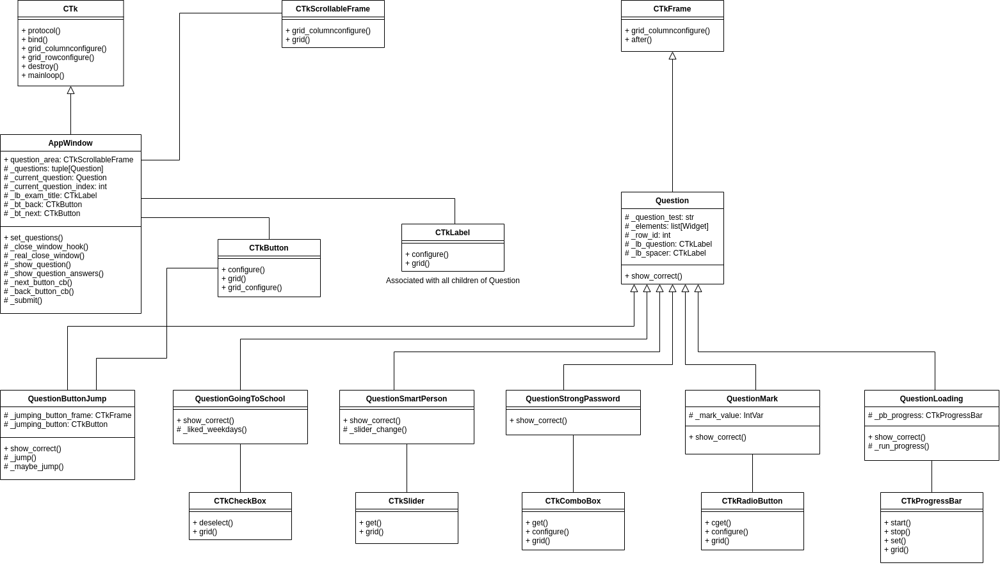

# Safer Moodle Browser 2.0

A dumb Python CTk demo that behaves weirdly.

## How to use it

Minimum Python version requirement: 3.10

To test it out, just install ```requirements.txt``` and run ```main.py```.

It is recommended to build a venv with the requirements.


## Structure

The following UML diagram describes the class structure of the program:


